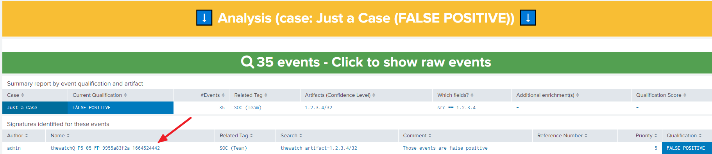

[](https://github.com/LetMeR00t/TA-ak_thewatch_v2/)

[](https://github.com/LetMeR00t/TA-ak_thewatch_v2/releases/)

[](https://github.com/LetMeR00t/TA-ak_thewatch_v2)

# The Watch v2 - A new way of detecting anomalies in your CIM logs, with ability to quality your alerts

# Overview
The goal of this application is to enhance Splunk Enterprise to add SIEM-like functionality for teams that do not have Splunk Enterprise Security.

- You use Splunk Enterprise to **collect and centralize your production or security logs** and you would like to have a system to monitor all these logs in order to identify specific elements (called artifacts).
- These artefacts may represent a threat to your business and **you want your security teams to be able to detect those artifacts** and remediate any incident linked to them.
- In addition, **you want to make the time spent by your analysts on the detections found in your logs profitable**. If your analysts have spent several hours identifying an alert as a false positive, you would like to be able to "qualify" the alert so that the next time an event matching this qualification (or signature) is detected, a different automated treatment is performed (such as not being alerted if it was considered a false positive by your teams)

Technically speaking, this TA allows you to :
- Easily set a monitoring on specific artifacts (IP, URL, Mails, Hash, Username etc.) stored in KV stores and be alerted when one of your event match at least one artifact thanks to the Splunk automatic lookups
- You can organize your artifacts through cases, also stored in KVStores, to link them and attach them a tag to have a specific process in case of a detection
- For every detection, you can choose the way you want to centralize your alerts and select a qualification for a specific signature (which relies on event types in Splunk)
- You can customize your qualifications/signatures in order to have specific process (for example, receive an alert in case of a NEW alert and not be alerted when the alert is qualified as FALSE POSITIVE), this is done by having saved searches on which you can customize the actions when The Watch events are detected.

# Requirements
In order to work with your logs, you must have setup your logs to follow the [CIM model](https://docs.splunk.com/Documentation/CIM/5.0.1/User/Overview) proposed by Splunk. The Watch is built to detect anomalies over CIM fields. The list of the monitored fields is available under the application through "Manage" > "Manage: Artifacts" on the bottom.

In case you identify that one CIM field is missing in the The Watch configuration, don't hesitate to raise an issue.

Most of the The Watch application is relying on Splunk Enterprise capabilities already present in the tool.

# First installation
When you install this application for the first time, you have to configure the application on some points.

Those instructions are available here: [Installation Guide](https://github.com/LetMeR00t/TA-ak_thewatch_v2/blob/main/TA-ak_thewatch_v2/README/installation_guide.md)

# How does it works ?

TBD

# Configuration

## Enable saved searches for detections
Let's initialize the saved searches used to perform the detection in your logs:

1. You will need to create a dedicated index for detected events by The Watch. For any detected event, The Watch will copy this event and enrich it with several information in a dedicated index. You are free to use whatever name you want. As an example for the following instructions, **the index name will be "thewatchv2"**
2. Once you have created your new index, go to the saved searches under "Settings" > "Searches, reports, and alerts" and select to filter on all owners.

3. You can filter on savedsearches starting with "[The Watch] Notable event found !". Every artifact type (hash, url, ip, etc) has three versions of the same kind of saved search

4. We will focus only on savedsearches that contains "24/7" (other savedsearches can be setup afterwards if you want to optimized performance of those savedsearches in your infrastructure). You can edit the alert and go to the custom alert action named "The Watch v2 : Create notable events". You will be able to put the name of your index here (in our example, we have chosen "thewatch")

5. You will have to iterate the same process for all types (url, hash, ip, etc) you want to monitor in your logs. It's not mandatory to activate all types of artifacts.

## Enable saved searches for notifications
Let's initialize the saved searches used to perform the notification (or any other action) in your logs:

1. Go to the saved searches under "Settings" > "Searches, reports, and alerts" and select to filter on all owners. Take a closer look to all savedsearches beginning with "The Watch - SOC".

2. If you want to be notified by something else than the internal Splunk alerts (as it's configured by default), you can customize it under the "Trigger Actions" of those savedsearches. Those savedsearches are all the same but have a different behavior depending on the time (see the description to have more information).


# Test your detection
Let's try to make your first detection with the The Watch application. We will look for a specific IP "1.2.3.4/32" and try to be alerted when an event is raised with this value.

**Prerequisites**: You have to follow the first installation procedure describe above before making this working.

## Add an IP under monitoring and check that the monitoring is working

### 1. Enable the savedsearch (detection) used for IPs

Make sure that you have enabled the savedsearch named "[The Watch] Notable event found ! (IP) 24/7" following the procedure just above ("Configuration" > "Enable saved searches for detections")

### 2. Create the case

Go to "Manage" > "Manage: Cases". Select the "Add" mode and fill those inputs:
| Field            | Value                 |
| ---------------- | --------------------- |
| name             | Just a Case           |
| tags             | SOC (Team)            |
| aggregation_type | Case + Qualification  |
| description      | Test case             |
| severity_levels  | MIN < 2 < 4 < 8 < MAX |

> **_NOTE:_**  The severity levels are not used here as the aggregation type is "Case + Qualification" and not "Alert". Read the documentation to have more information about those two modes.

You should have a new entry in the array:


### 3. Add an artifact to the case

Go to "Manage" > "Manage: Artifacts". Select the "Add" mode, using the "Manually" way, with the "IPs" type and fill those inputs:
| Field            | Value               |
| ---------------- | ------------------- |
| artifact         | 1.2.3.4             |
| lifetime         | +1 day              |
| case             | Just a Case         |
| description      | Just an IP for test |
| tlp              | GREEN               |
| confidence_level | HIGH                |

> **_NOTE:_**  You will notice that the network mask was not given. By default, The Watch considers that the IP is on a /32 network mask. If you want to specify a specific and larger mask, just append the network mask to the value (ex: 10.0.0.0/8).

> **_NOTE2:_**  The confidence level is only used for cases using the aggregation type "Alert" so it's not used in our example.

Once you've done this, click on the submit button on the top.

You should have a new entry in the array:


From now on, this IP is under monitoring by The Watch

### 4. Generate a fake event

Choose an index/sourcetype in which you want to index your fake event and replace the values on this example (here we put the fake event in the "temp" index with the sourcetype "test")
```spl
| makeresults
| eval src = "1.2.3.4"
| summaryindex index=temp sourcetype=test
```

### 5. First check: Automatic lookups should enrich this event

Run this SPL search (in verbose/smart mode, on the last 4 hours) and check the fields (replace the index/sourcetype values with yours):
```spl
index=temp sourcetype=test
```

You should see the enrichment in the logs:


If you can can see the new fields generated by The Watch (starting with "thewatch_artifact_"), please go further. Otherwise, start again the procedure to check if you don't make any mistake. If so, please raise an issue with the details of your actions.

## Ensure that detections are raised automatically

### 1. Check the running jobs

Go on the Splunk top panel under "Settings" > "Searches, report and alerts". Find the "[The Watch] Notable event found ! (IP) 24/7" entry and click on "View recent" to check the recent jobs performed.

### 2. Wait for the next job

Make a periodic refresh on this page. Once the next job is done, you should see that new events have been identified by the search. If not, try to generate again a new fake event and make sure that the owner of the saved search has access to the index by default.

### 3. Check the detections dashboard

Go to the dashboard "Detection" > "Detection: Event Qualification". If new events were raised on the previous task, you should see them in the dashboard (make a search on the last 60 minutes):


As those events are not matching any known signature, it's qualified as "NEW" by default.

## Qualify those new events as "FALSE POSITIVE"

### 1. Select the detections

As the case was configured to aggregate events as "Case + Qualification", it means that all events were aggregated together because they belong to the same case and have the same qualification.
Click on the entry of the case "Just a Case" qualified as "NEW".
It will load new searches below to give you more details about the detections.


As you can see, The Watch is showing that the value was identified in the "src" field, which is one of  the monitored CIM field for IPs. No signature exists at the moment and you can click on the green banner to access to the raw events.

### 2. Qualify those events

A qualification (or signature) is simply a Splunk event type built in a specific way. It's composed of an SPL search input linked to a qualification label.

In our example, we will qualify any event containing this artifact (but you can imagine whatever signature you want, based on other fields) those events as "FALSE POSITIVE". We keep the sourcetype as "Any" and we select the condition on which events have the same "Artifact (pattern)". We select then our artifact "1.2.3.4/32" and we write a comment on this qualification.

You will have an overview of your signature (SPL search representing the event type) below in a "Visual" mode but you can choose the "Text" mode to show it as a raw SPL search.

Once you have finish your qualification, just click on the "FALSE POSITIVE" button. You should see an output log saying that your qualification was taken into account and the list of the "10 Latest Signatures" shoudl be refreshed automatically with your new signature.


If you refresh this dashboard, you should see (maybe after few minutes) the new qualification taken into account in the first panel:


And if you click again on this entry, you should see the signature in the panel below:



We are presenting here only the detection dashboard but you can imagine having savedsearches running on new The Watch detection and that will process events depending on the qualification.

Congratulations, you have now validated the detection of an artifact in your logs ! Don't forget to remove the signature, artifact and case that you have created for this example.

# Monitoring the application
If you are using the default savedsearches of The Watch (24/7), they are not optimized and will try to identify artifacts in any sourcetype, whatever if the CIM fields are present or not. As we are performing large searches on the logs (even on a 5 minutes period, it can impact your infrastructure).

TBD

# FAQ
| Question                                                                            | Answer                                                                                                                                                                                                                                                                      |
| ----------------------------------------------------------------------------------- | --------------------------------------------------------------------------------------------------------------------------------------------------------------------------------------------------------------------------------------------------------------------------- |
| I can't see the events from the The Watch index in your dashboards, what can I do ? | Check that, by default, you are looking for the events of your The Watch indexes for the roles you have in Splunk. To do so, as an administrator connect to Splunk and go through Settings > Roles > (your role) > Index > (check that you have the default column checked) |

# Support
Please [open an issue on GitHub](https://github.com/LetMeR00t/TA-ak_thewatch_v2/issues) if you'd like to report a bug or request a feature.

# Credits
This app was developed to help brilliant colleagues and improve the response in the field of security

# License
MIT License

Copyright (c) 2022 LmR

Permission is hereby granted, free of charge, to any person obtaining a copy
of this software and associated documentation files (the "Software"), to deal
in the Software without restriction, including without limitation the rights
to use, copy, modify, merge, publish, distribute, sublicense, and/or sell
copies of the Software, and to permit persons to whom the Software is
furnished to do so, subject to the following conditions:

The above copyright notice and this permission notice shall be included in all
copies or substantial portions of the Software.

THE SOFTWARE IS PROVIDED "AS IS", WITHOUT WARRANTY OF ANY KIND, EXPRESS OR
IMPLIED, INCLUDING BUT NOT LIMITED TO THE WARRANTIES OF MERCHANTABILITY,
FITNESS FOR A PARTICULAR PURPOSE AND NONINFRINGEMENT. IN NO EVENT SHALL THE
AUTHORS OR COPYRIGHT HOLDERS BE LIABLE FOR ANY CLAIM, DAMAGES OR OTHER
LIABILITY, WHETHER IN AN ACTION OF CONTRACT, TORT OR OTHERWISE, ARISING FROM,
OUT OF OR IN CONNECTION WITH THE SOFTWARE OR THE USE OR OTHER DEALINGS IN THE
SOFTWARE.
